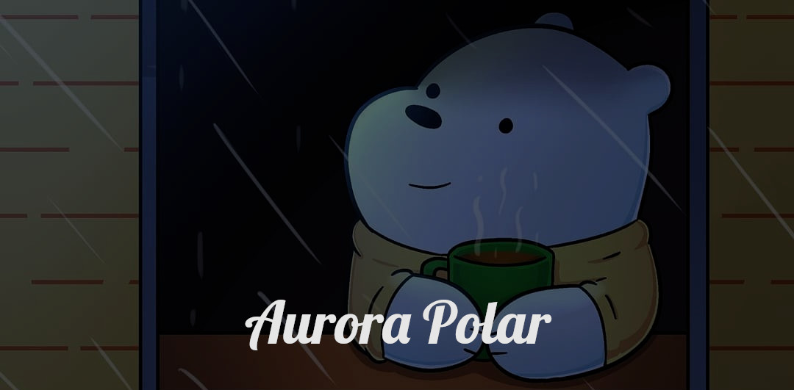

### ✨ Hello! I'm Cyrodwd/NekoCinnamon ✨

<!-- Basic Banner, Fixed the text "AuroraBear" changing it now to "AuroraPolar" (NOT USING)
 -->

### Intermediate programmer
-----------

## Skills

<!-- C -->

<!-- D -->

<!-- Lua -->

<!-- Ruby -->

<!-- Languages to learn
### To learn

-->

-----------------------------
<!-- Personal Information -->
### General information
* Introverted, socially shy and calm (sometimes)
* Not very active in the development space
* Languages: Spanish, but sometimes I speak English but not very well, therefore I have to use translators in some situations.
* I don't like to describe myself, so I share only these details.
* Likes vintage video games, FPS, sandbox games, and free/open-source programs. Also wolves, cats, dogs and red pandas.
* Enjoys learning, especially Linux

<!-- links and blablabla -->
### Links

<!-- Codeberg -->

<!-- Odysee
 -->
<!-- Forgejo -->

--------------------------------------------------------------------------------
### ✨ Have a good time and wish you all the best! ✨
